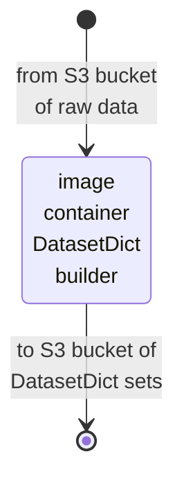
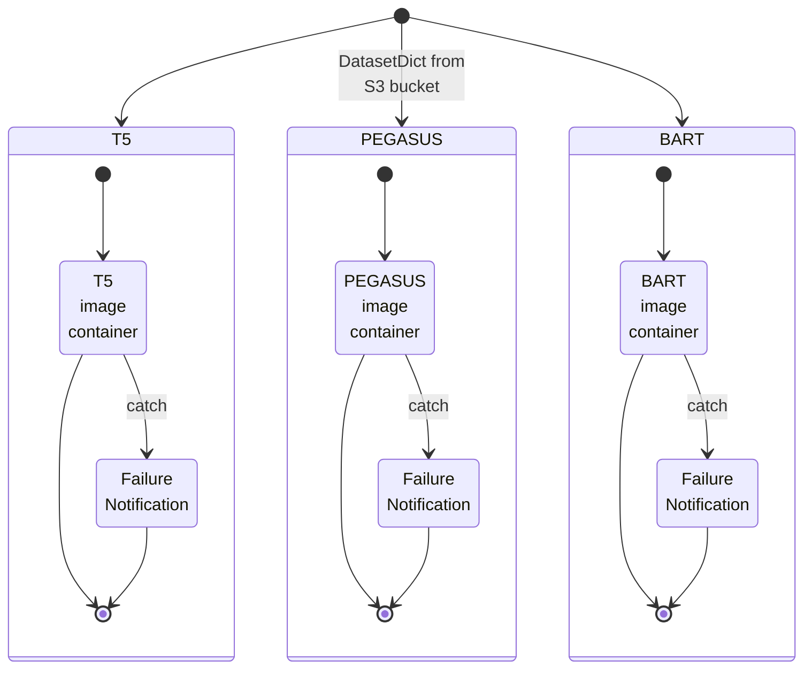
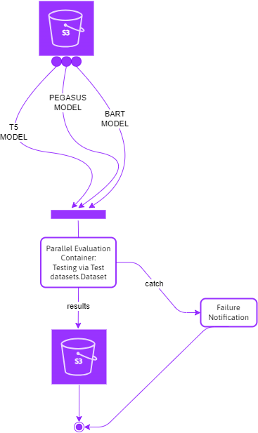

 

<<<<<<< HEAD
# System Architectures

## Modelling Development Phase

### Data

 
 

### Training & Validation Stage

Each container focuses on the development of a single abstractive text summarisation model.  In each case the container outputs, and saves, a model and evaluation results.

* T5: [Text to Text Transfer Transformer](https://arxiv.org/abs/1910.10683)
* PEGASUS:
    * [PEGASUS: Pre-training with Extracted Gap-sentences for Abstractive Summarization](https://arxiv.org/abs/1912.08777)
    * [PEGASUS: A State-of-the-Art Model for Abstractive Text Summarization](https://research.google/blog/pegasus-a-state-of-the-art-model-for-abstractive-text-summarization/)
* [BART: Denoising Sequence-to-Sequence Pre-training for Natural Language Generation, Translation, and Comprehension](https://arxiv.org/abs/1910.13461)

 
 

### Parallel Testing

=======
# System Architecture
>>>>>>> 735de18316d6f1077f32c46baa40014d41170c6f

 
 

 
 

 
 

 
 